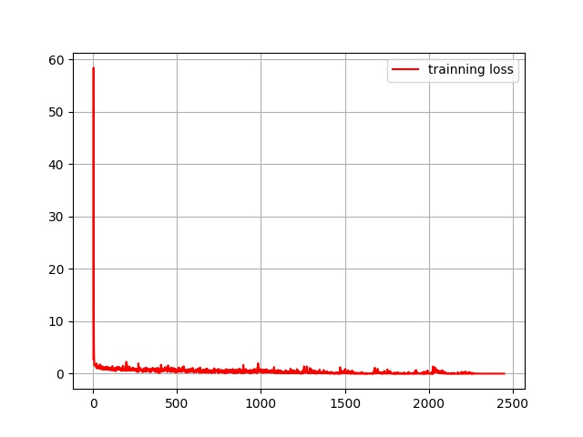
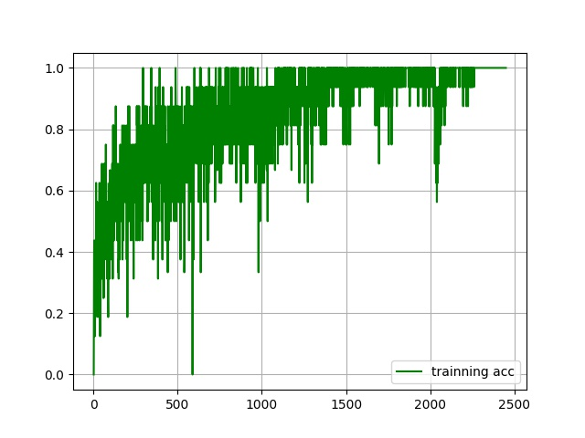
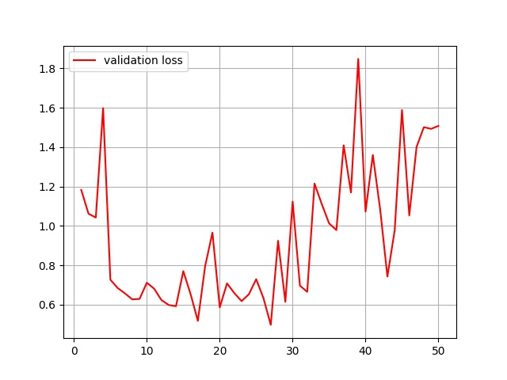
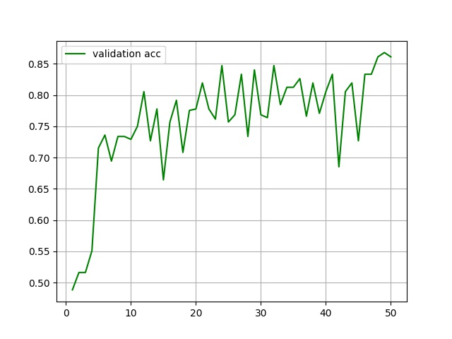

# 作业05：中草药分类

姓名：罗睿卿

学号：21214935

## 模型对比

我使用给出的数据集在**VGG、ResNet、MobileNetV1、MobileNetV2**中分别进行了训练。在表中分别列出了具体的模型和训练中的各项超参数，以及训练得到的模型在测试集上的loss和acc。

从下表可以看出，经过**数据增强**之后，正确率会大幅提升。

在测试数据集中以及所有模型和不同的超参数设置下，accuracy最高的是**经过数据增强的GoogLeNet和VGG**，均达到了89.93%，loss最低的是**经过数据增强的GoogLeNet**，达到了0.3531，显然过拟合了。

|network|batch_size|lr|epoch|Augmentor|eval_loss|eval_acc|
|:-:|:-:|:-:|:-:|:-:|:-:|:-:|
|VGG|16|0.0001|50|False|1.8070|0.8310|
|VGG|32|0.0001|50|**True**|0.52911|**0.8993**|
|GoogleNet|16|0.0001|50|False|0.5240|0.8542|
|GoogleNet|32|0.0001|50|**True**|**0.3531**|**0.8993**|
|MobileNetV1|16|0.0001|50|False|1.3702|0.7338|
|MobileNetV2|16|0.0001|50|False|1.1576|0.6713|
|ResNet50|16|0.0001|50|False|0.9013|0.7754|

## 结果分析

**综合来看以下模型在测试集中的表现最好：**

- **在经过数据增强的情况下，表现最好的是GoogLeNet和VGG，acc达到了89.93%；**
- **在未经过数据增强的情况下，表现最好的是GoogleNet，acc达到了85.42%。**

## VGGNet训练结果的可视化

- Training Loss

trainging loss 随每个 batch 更新的变化过程

- Training Acc

training acc 随每个 batch 更新的变化过程

- Validation Loss

validation loss 随着每个 batch 更新的变化过程

- Validation Acc

validation acc 随着每个 batch 更新的变化过程

