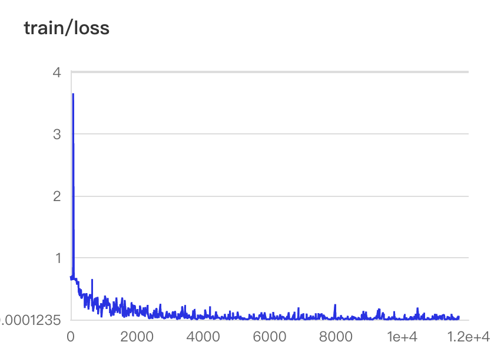
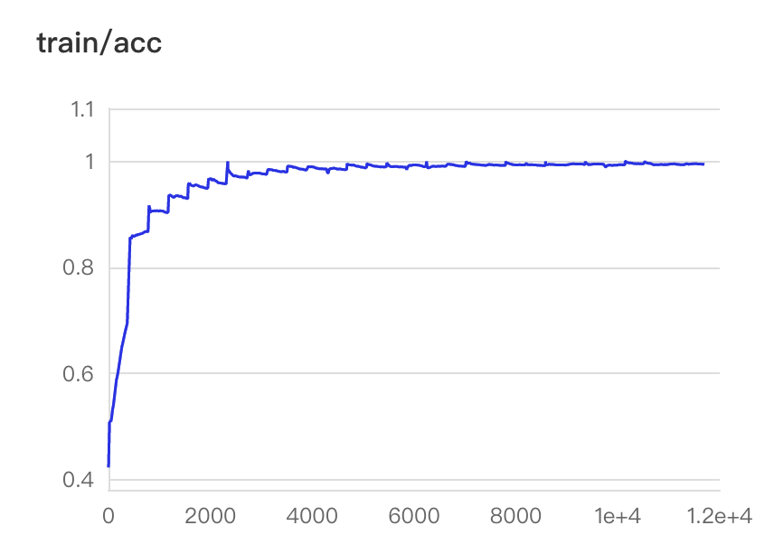
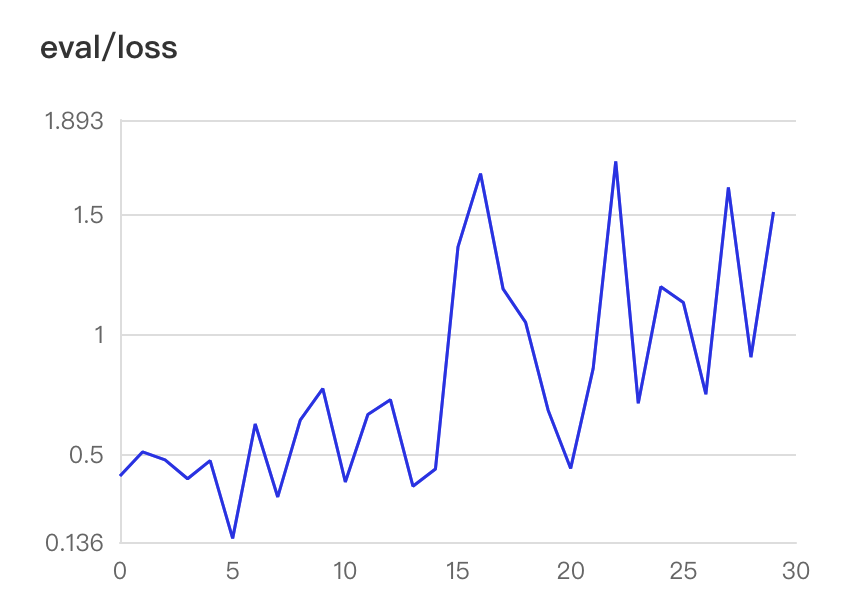
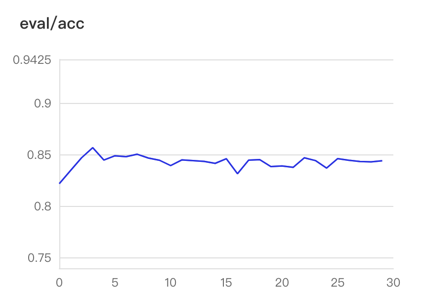
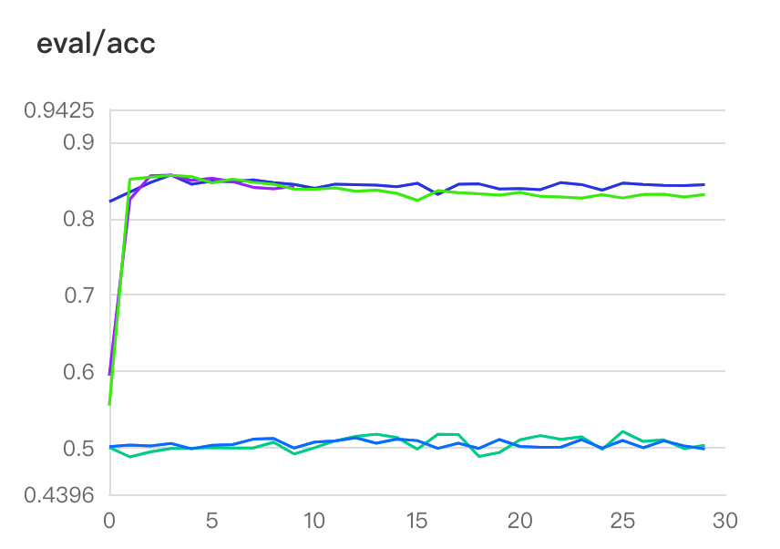
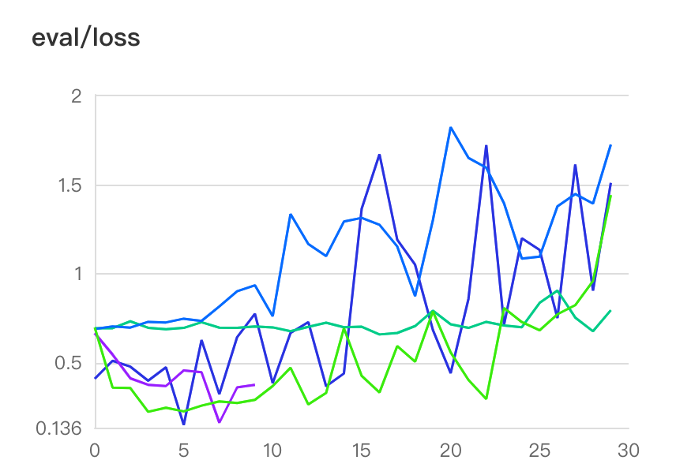

# 作业06：文本情感分析

姓名：罗睿卿

学号：21214935

## 模型对比

我使用给定的数据集在**基于GRU模型的网络和基于RNN模型的网络**中分别进行了训练。在表中分别列出了具体的模型和训练中的各项超参数，以及训练得到的模型在测试集上的loss和acc。

从下表可以看出，**使用基于GRU的网络，最终得到的Acc相对于基于RNN的网络，正确率会大幅提升**。

在测试数据集中以及所有模型和不同的超参数设置下，**Acc**最高的是**学习率为0.001，epoch为30的GRU**，达到了84.411%，**Loss**最低的是**学习率为0.0001，epoch为10的GRU**，达到了0.53577。

|network|batch_size|lr|epoch|eval_loss|eval_acc|
|:-:|:-:|:-:|:-:|:-:|:-:|
|**GRU**|64|0.001|30|1.53918|**0.84411**|
|GRU|64|0.0001|30|1.14491|0.83129|
|GRU|64|0.0001|10|**0.53577**|0.84202|
|RNN|64|0.001|30|0.94940|0.50360|
|RNN|64|0.0001|30|1.95301|0.49867|

## 结果分析

**综合来看学习率为0.001，epoch为30的基于GRU网络的模型在测试集中的表现最好。**由上表中的结果可以看到，学习率和epoch对acc的影响是很随机的，并没有固定的对训练效果的影响，需要经验的调整。

## GRN训练结果的可视化

将Acc最高的网络及策略——学习率为0.001，epoch为30的GRN网络的训练结果可视化：

- Training Loss

trainging loss 随每个 batch 更新的变化过程

- Training Acc

training acc 随每个 batch 更新的变化过程

- Eval Loss

Eval loss 随着每个 batch 更新的变化过程

- Eval Acc

Eval acc 随着每个 batch 更新的变化过程

- All Eval Acc

表中所有Eval acc 随着每个 batch 更新的变化过程

- All Eval Loss

表中所有Eval loss 随着每个 batch 更新的变化过程

